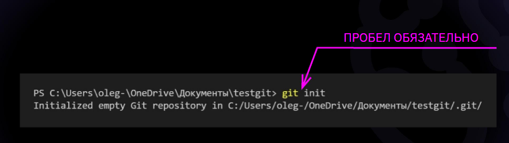
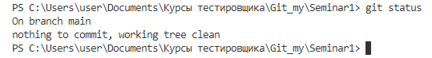
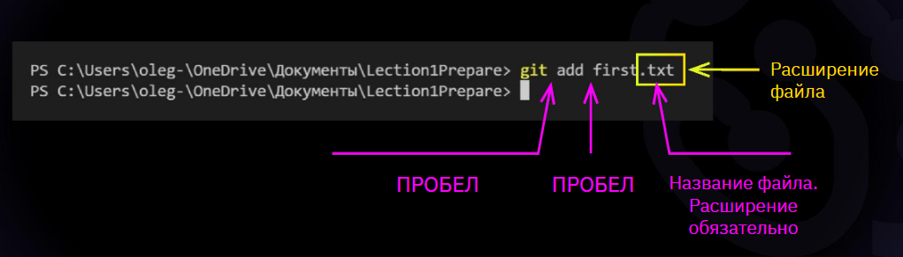
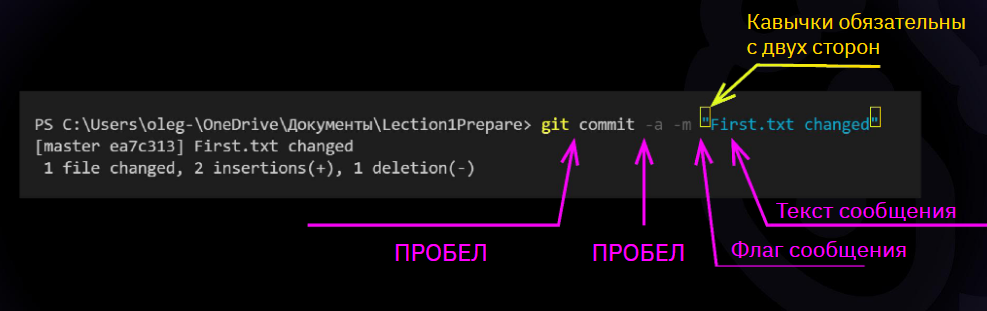
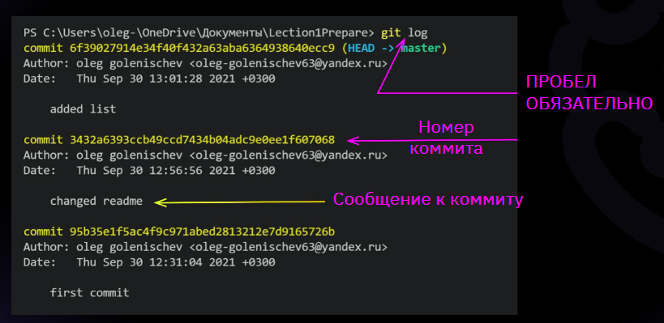
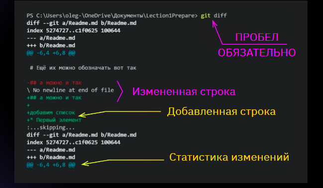
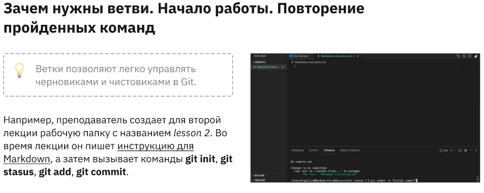
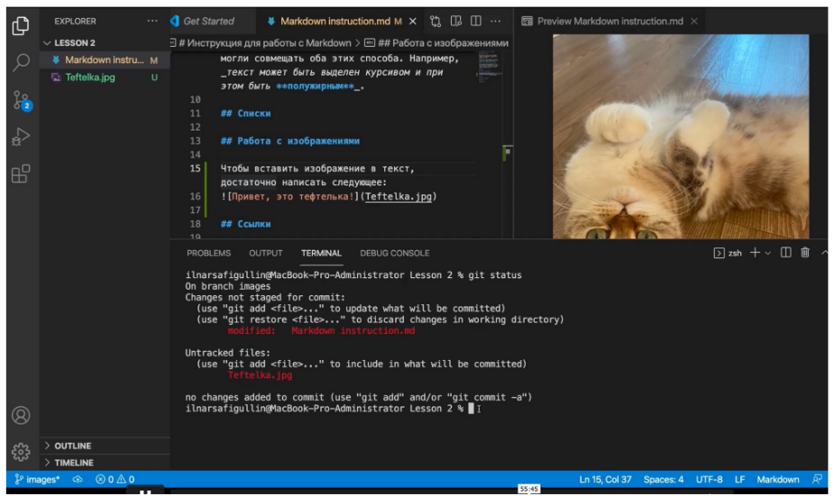
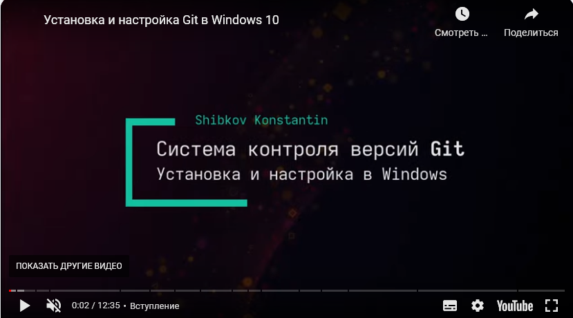

# Инструкция по работе с Git

## 1. Основные команды

*git inut* - **инициализация репозитория**

*git status* - **вывод статуса репозитория на момент времени**

*git add* - **добавление файлу(файлам) версионности**

*git commit -m <message>* - **фиксация сообщений**

*git log* - **вывод журнала изменений**

*git log --graph* - **просмотр дерева commit**

*git diff* - **вывод изменений по сравнению с предыдущим коммитом**

*git checkout <первые 5 знаков версии>* - **перемещения между сохранениями**

> При работе с git, после каждого изменения, необходимо сохранять информацию. Для сохранения необходимо нажать комбинацию клавиш на клаиатуре:

*[ctrl] + [s]* - **сохранение после каждого изменения**

> Если при работе с git в терминале выходит строка end, для возвращения курсора необходимо нажать клавишу:

*[q]* - **выход из end в терминале**

## 2. Команды по ветвлению

 

*git branch* - **команда для вывовда списка веток**

*git branch <branch_name>* - **создание и переключение на новую ветку**

*git branch -d <branch_name>* - **команда для уданиения ветки**

*git checkout -b <branch_name>* - **создание и переименование ветки**

*git checkout <branch_name>* - **переключение на новую ветку**

*git merge* - <branch_name> - **команда для слияния веток**

## 3. Добавление картинки
** - **если картинка находится внутри текущей папки**

## 4. Добавление ссылок

*Текст \["Имя ссылки"\](ссылка).* - **для добавления ссылок в текст необходимо текст гиперссылки обрамить квадратными скобками [] а после указать ссылку в круглых скобках()**

## 5. Добавление видео

** - **Для добавления ссылки на видео в виде картинки, необходимо в квадратных скобках поставить знак восклидцания !, затем в квадратных скобках указать имя идео [Имя видео] и после в круглых скобках ссылку или путь на картинку(изображение для ссылки). После кваратных скобок необходимо добавить ссылку на видео в круглых скобок (ссылка на видео).**
___

## Материалы и инструкции:

Презентация на тему ["Введение в контроль версий" V 1.0](https://gbcdn.mrgcdn.ru/uploads/asset/3382251/attachment/b5c88675c477bd530bd5b532a181cf2f.pdf).

